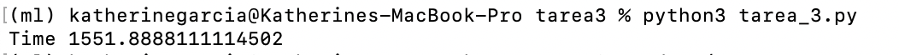
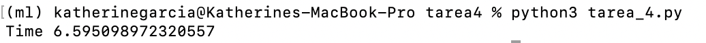

# Tarea 4 - Fast Sharp Effect
Mejore el desempeño de su filtro Sharp Effect que programó en la tarea 3 utilizando Cython.

Agregue un comentario dentro del docstring de su función, explicando el speedup obtenido Vs. La implementación de la tarea 3 utilizando un video .mp4 como material de prueba.

### Speed up de = 235.49


Tiempo original = 1551.88


Tiempo cython = 6.59



Ejecutar como ```python tarea_4.py``` en la misma carpeta del video
